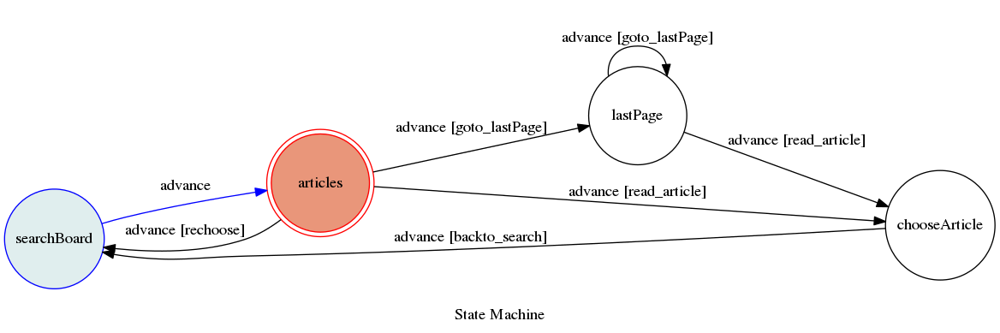

# TOC-Project
A telegram bot based on a finite state machine.
## purpose
help people surf ptt in telegram app
## how to use
Just insert the board you want to browse, the bot will print the newest page of articles. Than you can choose to watch the previous page or choose an article to read. You are able to go back to the first state anytime.
## fsm
* viwe FSM dynamic => `https://WEBHOOK_URL/show-fsm`

